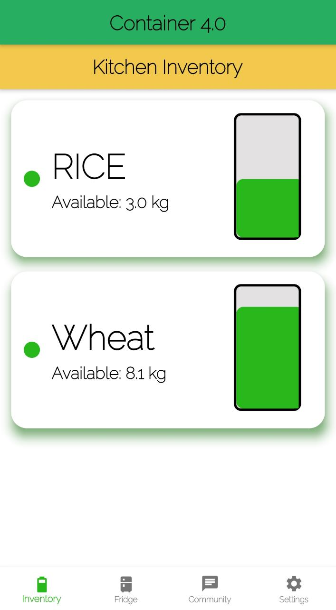
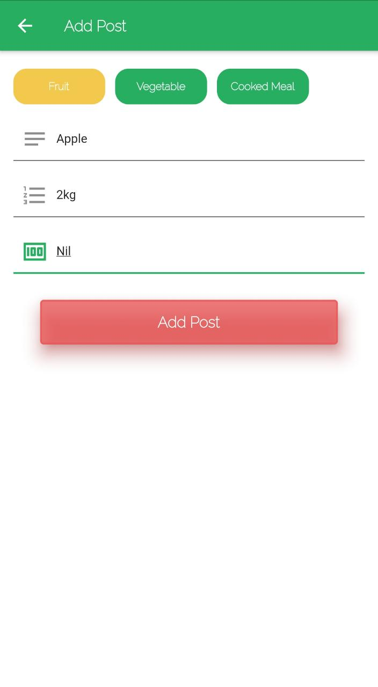

<!-- PROJECT LOGO -->
 

  <h1 align="center">Container 4.0</h1>
  
 <i>
    Smartify your kitchen!
    </i>
     
     
  

<!-- TABLE OF CONTENTS -->

  
Table of Contents

  <ol>
    <li>
      <a href="#about-the-project">About The Project</a>
      <ul>
        <li><a href="#built-with">Built With</a>
        <ul>
        <li><a href="#built-with">Hardware</a>
        <li><a href="#built-with">Software</a>
        </ul>
        </li>
      </ul>
    </li>
    <li><a href="#key-features">Key Features</a></li>
    <li><a href="#screenshots">Screenshots</a></li>
    <li><a href="#contributors">Contributors</a></li>
    <li><a href="#license">License</a></li>
    <li><a href="#acknowledgements">Acknowledgements</a></li>
  </ol>

<!-- ABOUT THE PROJECT -->
## About The Project
### Built With
####  Hardware 

<li>Raspberry Pi model 2B+<li>
HX711<li>
DHT-11 Temperature and humidity sensor<li>
Load cell (6 kg)<li>
MQ3 Alcohol Ethanol Sensor

#### Software

<li>Flutter

## Key Features

<li>Monitor quantity of food<li>
Monitor quality of food<li>
Food community support<li>
Fridge door open indication<li>
Auto-order

<!-- USAGE EXAMPLES -->
## Screenshots

### App Screenshots

  &nbsp; &nbsp; &nbsp; &nbsp; 
  

&nbsp; &nbsp; 

 &nbsp; &nbsp; &nbsp; &nbsp; 
  

<!-- CONTRIBUTORS -->
## Contributors
:smile:
1) [Twisha Shah](https://github.com/high-functioning-sociopath)
2) [Antara Borkar](https://github.com/high-functioning-sociopath)
3) [Ketaki Mulye](https://github.com/high-functioning-sociopath)
4) [Dipti Kawanpure](https://github.com/high-functioning-sociopath)

<!-- LICENSE -->
## License

Distributed under the MIT License. See `LICENSE` for more information.

<!-- MARKDOWN LINKS & IMAGES -->
<!-- https://www.markdownguide.org/basic-syntax/#reference-style-links -->

