<!-- PROJECT LOGO -->
 

    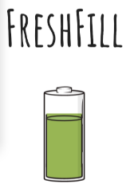
    <h1 align="center">FreshFill</h1>
   
<i>
      "Smartify" your Kitchen!
      </i>
      
<i>
            from Zero Waste to Zero Hunger!
            </i>
             
             
      

    

  

<!-- TABLE OF CONTENTS -->

  
Table of Contents

  <ol>
    <li>
      <a href="#about-the-project">About The Project</a>
      <ul>
        <li><a href="#proposed-solution">Proposed Solution</a>
        <li><a href="#about-the-project">UN Goals</a>
        <li><a href="#built-with">Built With</a>
        <ul>
            <li><a href="#built-with">Hardware</a></li>
            <li><a href="#built-with">Software</a></li>
      </ul>
        </li>
      </ul>
    </li>
     <li><a href="#project-demo">Project Demo</a></li>
    <li><a href="#architecture">Architecture</a>
        <ul>
        <li><a href="#project-architecture">Project Architecture</a>
        <li><a href="#connections">Connections</a>
        </ul>
      </li>
    <li><a href="#key-features">Key Features</a></li>
    <li><a href="#screenshots">Screenshots</a></li>
    <li><a href="#contributors">Contributors</a></li>
    <li><a href="#license">License</a></li>
    </ol>

<!-- ABOUT THE PROJECT -->
# About The Project
  

    

    Every year, around 1.3 billion tons of food is being wasted around the globe. 
    Another report by Food Trust indicates that around 50% of the thrown waste is still edible.
    If somehow, we can manage out kitchens in such a way to avoid overstock and wastage of food, 
    it many benefit nearly 9 million people, who die out of hunger and hunger-related diseases. 
    

    <i>Leveraging the power of IoT and data analytics, we propose a simple consumer based application - <b>FreshFill</b></i>
     
    <b>Note: </b> This repository is for the purpose of ESS Project (TY - B.Tech Electronics, VJTI, Mumbai)
    

  

## Proposed Solution

  

  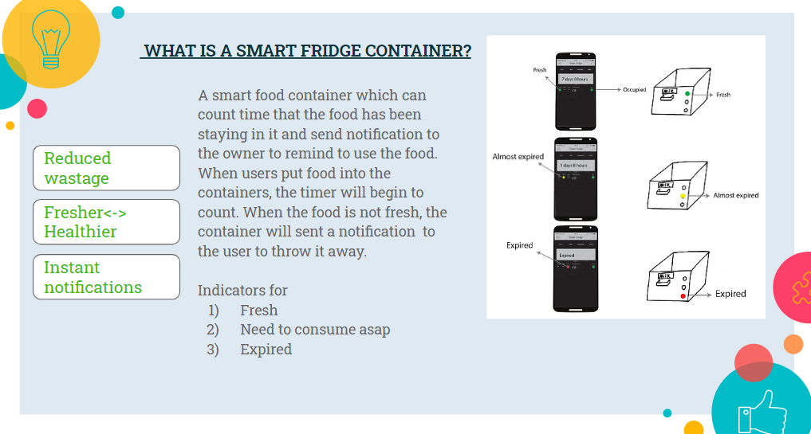

## UN Goals

  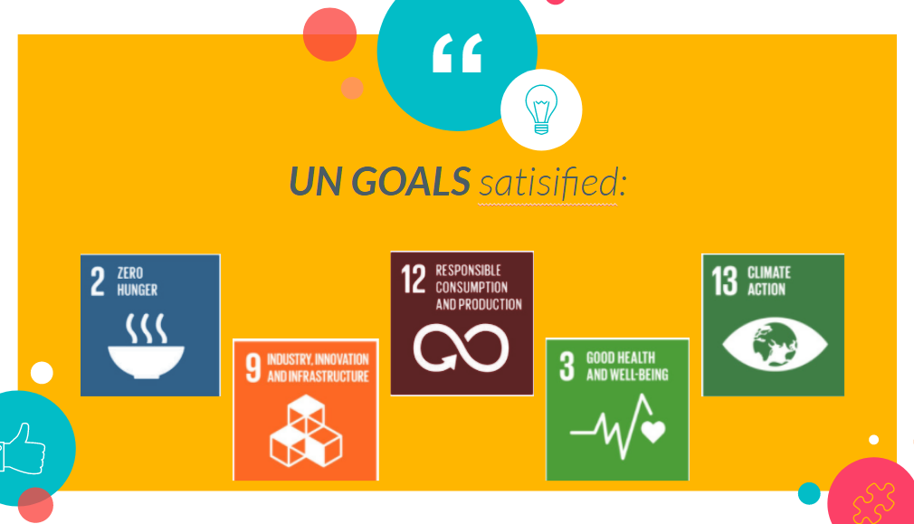

      
  
## Built With
###  Hardware 

<li>Raspberry Pi model 2B+
<li>DHT-11 Temperature and humidity sensor
<li>Load cell (6 kg)
<li>HX711
<li>MQ3 Alcohol Ethanol Sensor

### Software

<li>Python</li>
<li>Flutter</li>
<li>Firebase Realtime database</li>

# Project Demo

    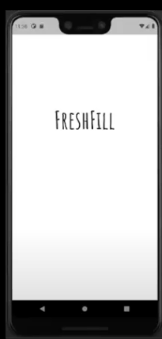
     
    <a href="https://drive.google.com/file/d/1QBMq46aj7z1aQ7YXLMyRCDLZ4_NpmKxJ/view">View Full Demo</a>

# Architecture
### Project Architecture

  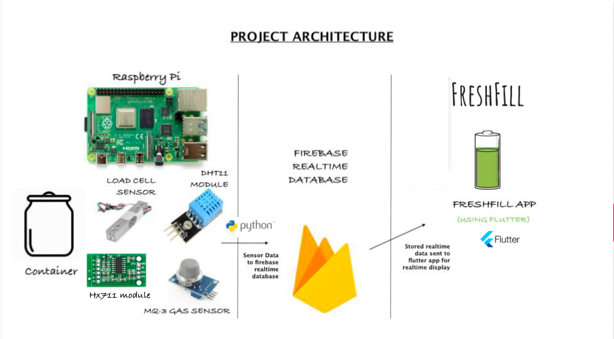

### Connections

   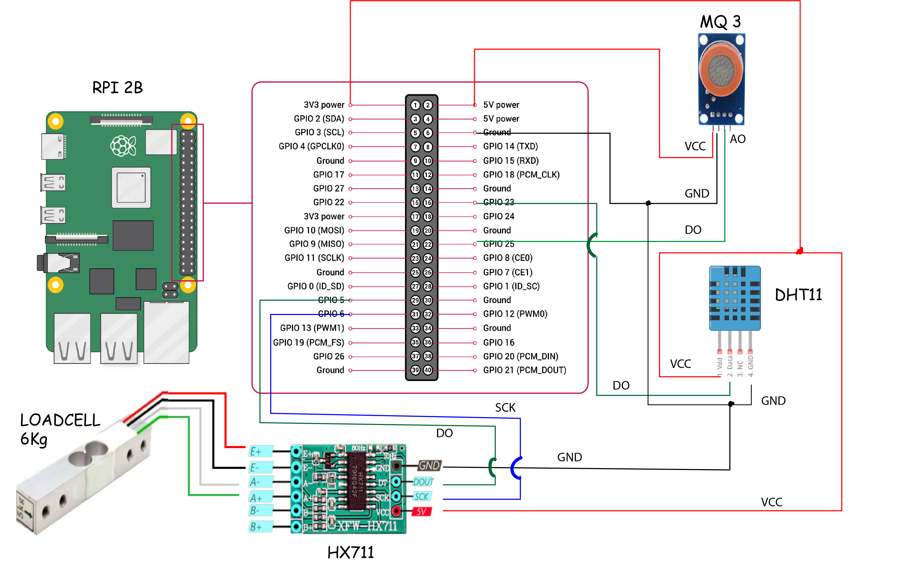

# Key Features
<li>Monitor quantity of food<li>
Monitor quality of food<li>
Food community support<li>
Fridge door open indication<li>
Auto-order

<!-- USAGE EXAMPLES -->
# Screenshots

## App Screenshots

  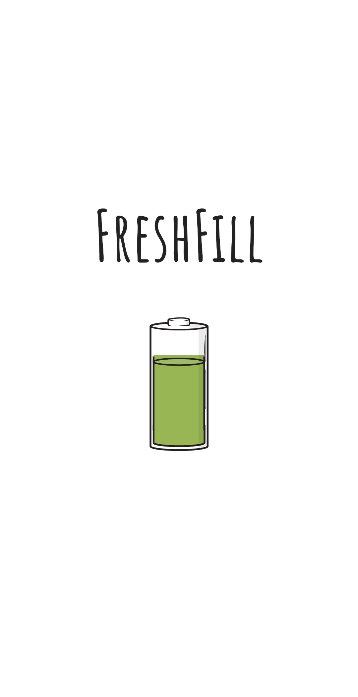&nbsp; &nbsp; &nbsp; &nbsp; 
  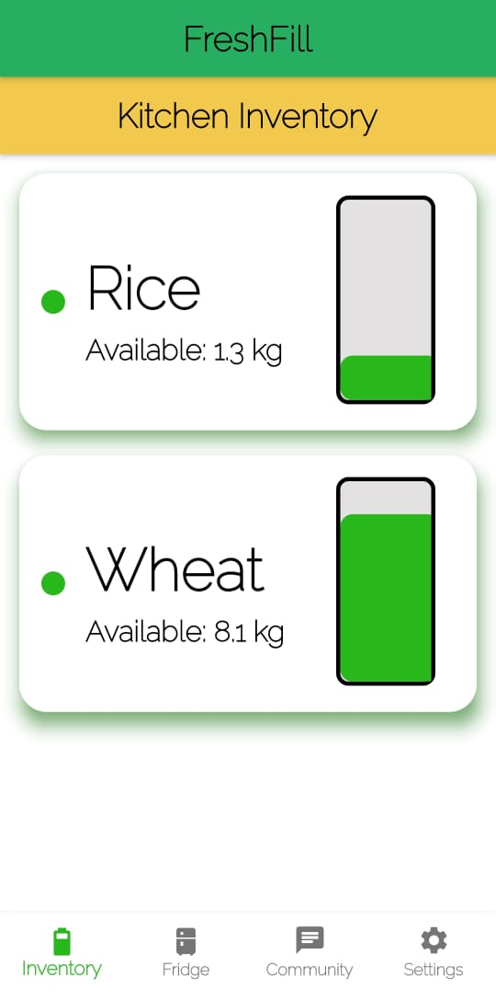

&nbsp; &nbsp; 

 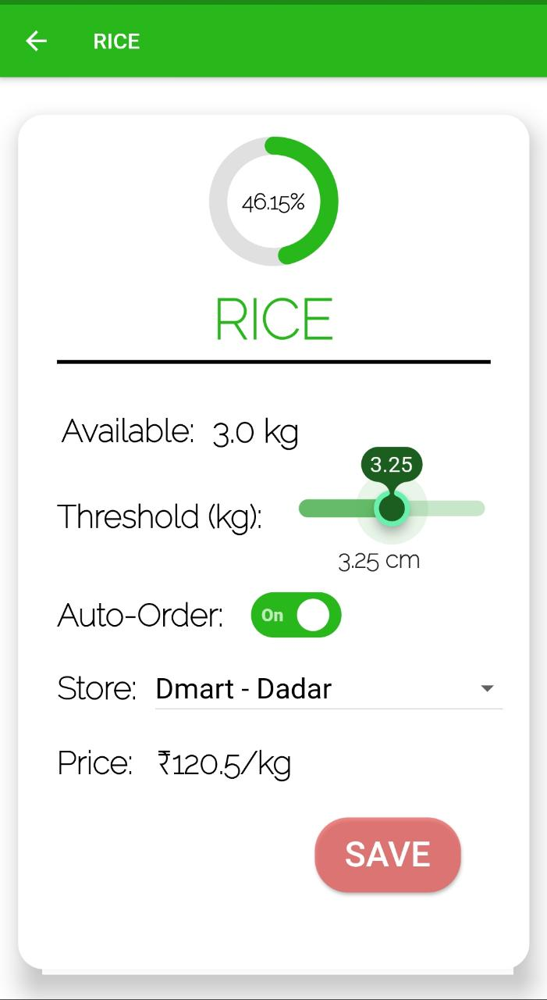&nbsp; &nbsp; &nbsp; &nbsp; 
  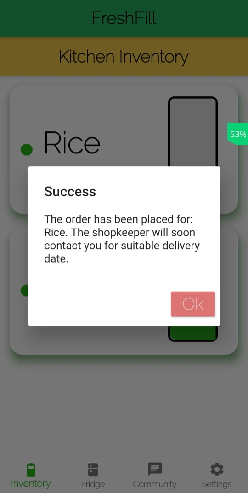

&nbsp; &nbsp; 

 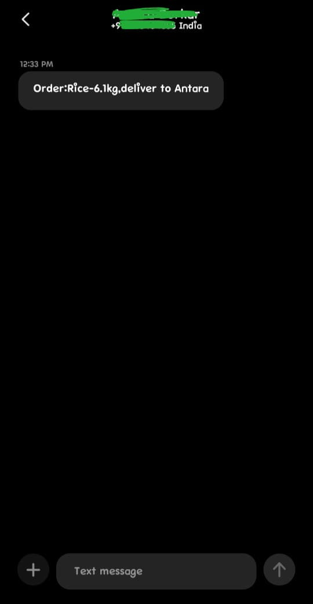&nbsp; &nbsp; &nbsp; &nbsp; 
  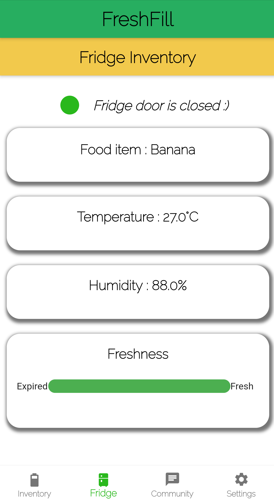

&nbsp; &nbsp; 

 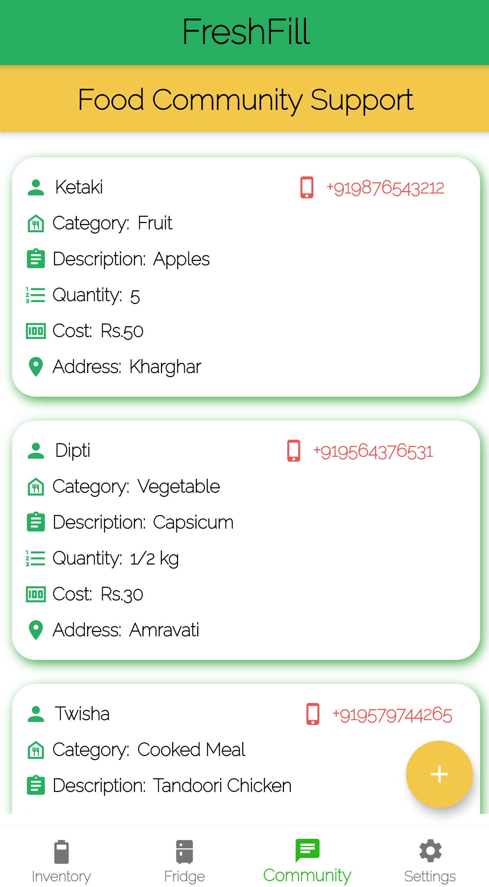&nbsp; &nbsp; &nbsp; &nbsp; 
  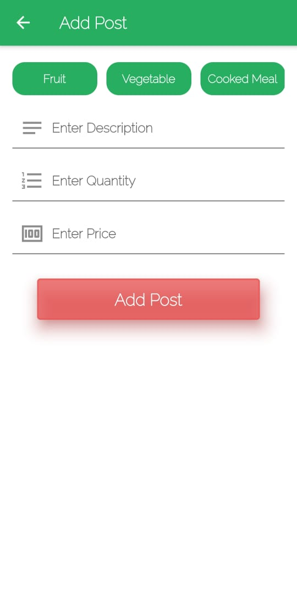

<!-- CONTRIBUTORS -->
# Contributors
:smile:
1) [Twisha Shah](https://github.com/high-functioning-sociopath)
2) [Antara Borkar](https://github.com/antara201)
3) [Ketaki Mulye](https://github.com/ketaki122)
4) [Dipti Kawanpure](https://github.com/diptikk)

<!-- LICENSE -->
# License

Distributed under the MIT License. See `LICENSE` for more information.

<!-- MARKDOWN LINKS & IMAGES -->
<!-- https://www.markdownguide.org/basic-syntax/#reference-style-links -->

