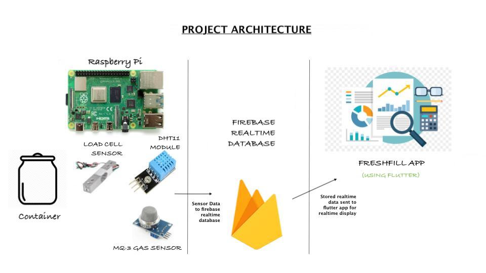
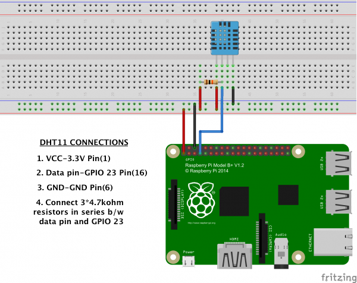
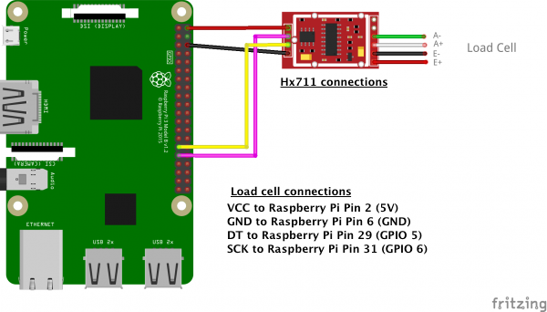
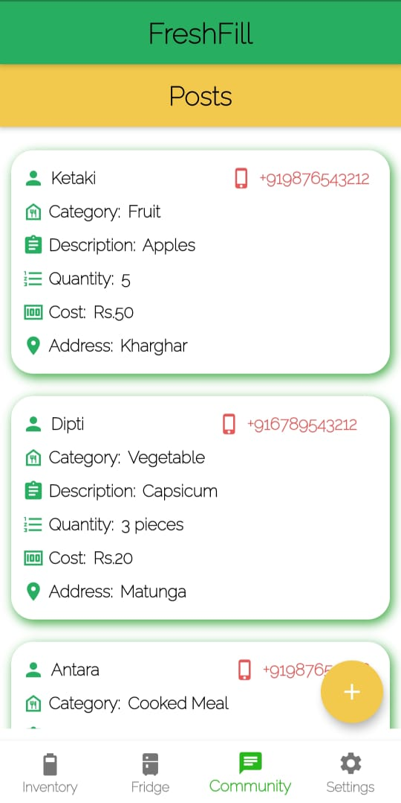

<!-- PROJECT LOGO -->
 

    
    <h3 align="center">FreshFill</h3>
   
<i>
      "Smartify" your Kitchen!
      </i>
      
<i>
           From from Zero Waste to Zero Hunger!
            </i>
             
             
      

    

  

<!-- TABLE OF CONTENTS -->

  
Table of Contents

  <ol>
    <li>
      <a href="#about-the-project">About The Project</a>
      <ul>
        <li><a href="#about-the-project">UN Goals</a>
        <li><a href="#built-with">Built With</a>
        <ul>
            <li><a href="#built-with">Hardware</a></li>
            <li><a href="#built-with">Software</a></li>
      </ul>
        </li>
      </ul>
    </li>
    <li><a href="#architecture">Architecture and Connections</a>
    <li><a href="#key-features">Key Features</a></li>
    <li><a href="#screenshots">Screenshots</a></li>
    <li><a href="#contributors">Contributors</a></li>
    <li><a href="#license">License</a></li>
    <li><a href="#acknowledgements">Acknowledgements</a></li>
  </ol>

<!-- ABOUT THE PROJECT -->
## About The Project
    Every year, around 1.3 billion tons of food is being wasted around the globe. Another report by Food Trust indicates that around 50% of the thrown waste is wtill edible.
    If somehow, we can manage out kitchens in such a way to avoid overstock and wastage of food, it many benefit nearly 9 million people, who die out of hunger and hunger-related diseases.
    
    Leveraging the power of IoT, AI and computer vision techniques, we propose a simple consumer based application - "FreshFill".

#### UN Goals
    

      
       
       
    

    
    Note: This repository is for the purpose of ESS Project (TY - B.Tech Electronics, VJTI)  
### Built With
####  Hardware 

<li>Raspberry Pi model 2B+<li>
HX711<li>
DHT-11 Temperature and humidity sensor<li>
Load cell (6 kg)<li>
MQ3 Alcohol Ethanol Sensor

#### Software

<li>Python</li>
<li>Flutter</li>
<li>Firebase Realtime database</li>

## Architecture and Connections

   
  

  
  

## Key Features
<li>Monitor quantity of food<li>
Monitor quality of food<li>
Food community support<li>
Fridge door open indication<li>
Auto-order

<!-- USAGE EXAMPLES -->
## Screenshots

### App Screenshots

  &nbsp; &nbsp; &nbsp; &nbsp; 
  

&nbsp; &nbsp; 

 &nbsp; &nbsp; &nbsp; &nbsp; 
  

&nbsp; &nbsp; 

 &nbsp; &nbsp; &nbsp; &nbsp; 
  

<!-- CONTRIBUTORS -->
## Contributors
:smile:
1) [Twisha Shah](https://github.com/high-functioning-sociopath)
2) [Antara Borkar](https://github.com/antara201)
3) [Ketaki Mulye](https://github.com/ketaki122)
4) [Dipti Kawanpure](https://github.com/diptikk)

<!-- LICENSE -->
## License

Distributed under the MIT License. See `LICENSE` for more information.

<!-- MARKDOWN LINKS & IMAGES -->
<!-- https://www.markdownguide.org/basic-syntax/#reference-style-links -->

